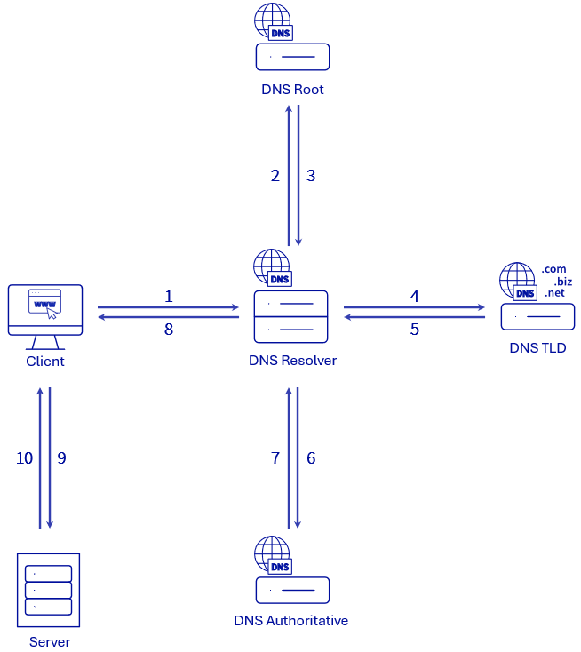

C'est un système qui sert à résoudre un nom de domain en [[file:Réseau informatique/Adresse/Logique/IP.org][adresse IP]].

** Comment ça marche ?

Il y a des serveurs DNS qualifié de résolveur, ils intérogent d'autres serveurs DNS qui contiennent réellement les [[file:DNS/Zone.org][Zone]] DNS, c'est-à-dire un serveur faisant [[file:DNS/Serveur/Autorité.org][Autorité]].

Voici un schéma des étapes d'une résolution de nom de domaine.

#+begin_src query
path:./*
#+end_src
